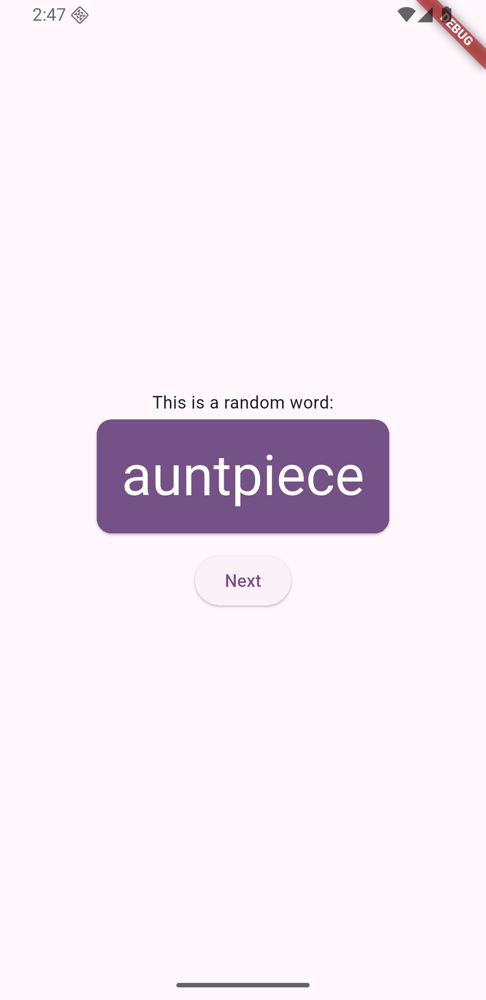
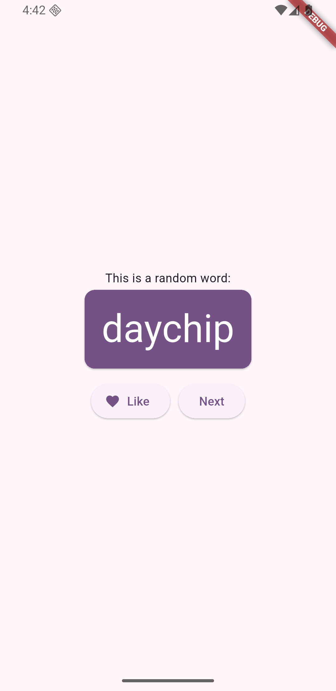
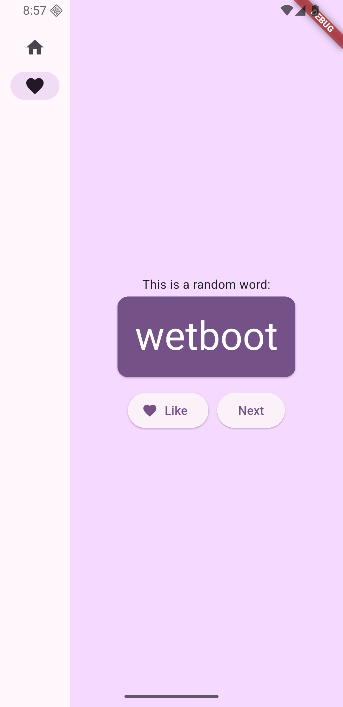
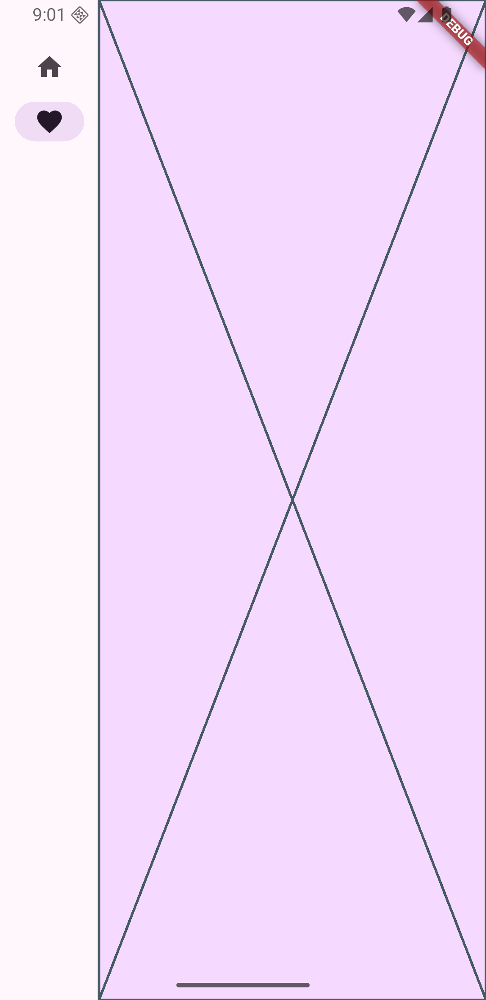
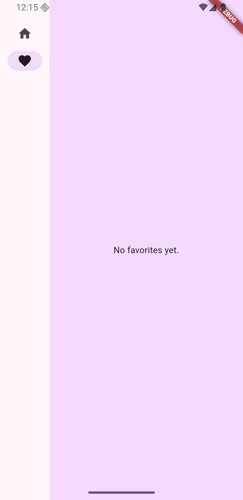
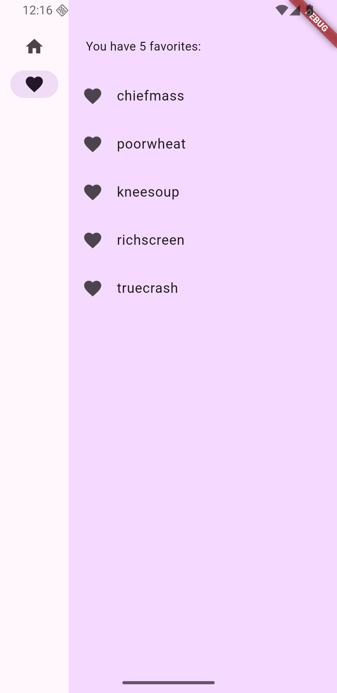
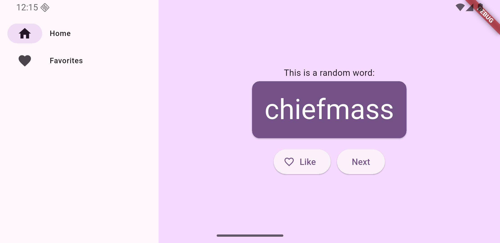

# ¡Primera app en Flutter!

Esta es mi primera app en Flutter, donde estoy aprendiendo su funcionamiento y comparándolo con otros sistemas de UI como Android XML y SwiftUI, mientras sigo este [Codelab de Google](https://codelabs.developers.google.com/codelabs/flutter-codelab-first?hl=es-419#0)

De momento, solo estoy tocando el archivo `libs/main.dart` y poco a poco iré añadiendo funcionalidades!

## ¿Qué hace la app?

Es una app que genera de forma automática al darle a un botón una palabra random compuesta de dos palabras, obtenida de un método externo hecho por el autor del codelab de google.

Además, tiene la funcionalidad de guardar las palabras que más te gusten en una lista de favoritos, pudiendo ver la lista de los mismos en la pantalla 'Favorites'.

## 📱 Capturas de pantalla

1- Añadidos los widgets principales: texto y botón que al pulsar muestra una palabra compuesta random

2- Añadida nuevo botón con la funcionalidad de guardar palabras en favoritos:

3- Añadida una barra lateral con dos opciones (home y favoritos)

4- Se coloca un `placeHolder()` en la pantalla favoritos antes de implementarla:

5- Se implementa la pantalla de favoritos, en la que aparece una lista de los favoritos que se tienen, o si no hay, una frase indicando que no hay

6- Se tiene en cuenta con `extended: constraints.maxWidth >= 600` que la palabra junto al icono de la pantalla Home o Favorites solo aparezca cuando se tenga el espacio suficiente, en este caso, estableciendo que este espacio son 600px relativos.

